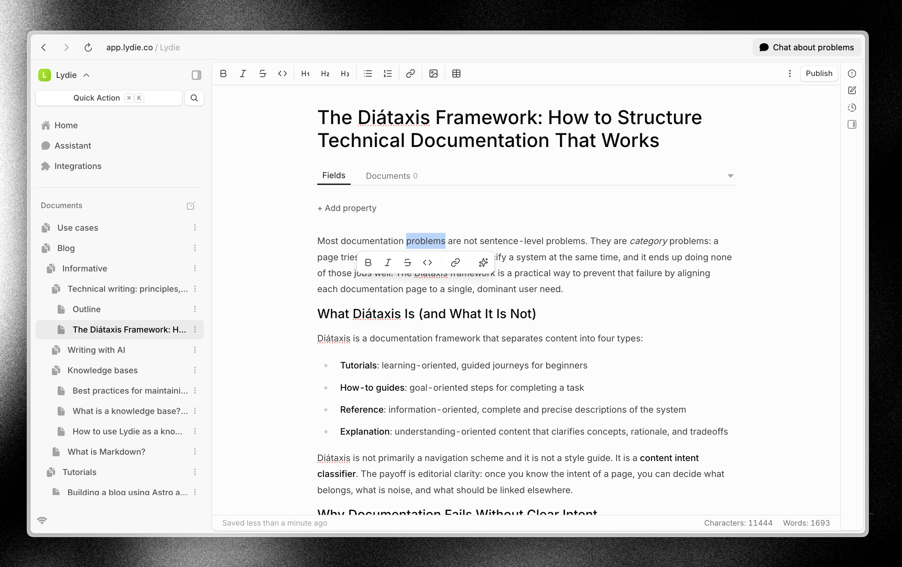

# Lydie

Lydie is a high-performance writing workspace that scales from simple notes to deeply structured, interconnected knowledge systems.



## 🚀 Quick Start

### Development (Docker)

```bash
cd docker && docker compose -f docker-compose.yml -f docker-compose.dev.yml up -d
```

Access:

- **Web App**: http://localhost:3000
- **Backend API**: http://localhost:3001
- **Zero Sync**: http://localhost:4848

Run migrations:

```bash
cd packages/database && bunx drizzle-kit migrate
```

### Production (AWS)

See [Deployment Guide](docs/DEPLOYMENT.md) for AWS deployment with Pulumi.

```bash
cd infrastructure
pulumi stack select production
pulumi config set domainName yourdomain.com
pulumi up
```

## 🛠️ Tech Stack

- **Frontend**: React, Vite, TanStack Router
- **Backend**: Hono, Better Auth
- **Database**: PostgreSQL, Drizzle ORM
- **Real-time**: Zero sync, WebSockets
- **AI**: Vercel AI SDK
- **Infrastructure**: Docker (local), Pulumi + AWS (production)

## 📁 Project Structure

```
├── docker/                 # Docker Compose for local dev
├── infrastructure/         # Pulumi AWS infrastructure
├── packages/
│   ├── config/            # Environment configuration
│   ├── web/               # React SPA
│   ├── backend/           # Hono API server
│   ├── core/              # Shared logic
│   ├── database/          # Drizzle ORM schema
│   └── zero/              # Zero sync configuration
└── docs/
    └── DEPLOYMENT.md      # Local dev, self-hosting & AWS deployment
```

## 📦 Deployment Options

| Environment   | Command      | Notes                          |
| ------------- | ------------ | ------------------------------ |
| **Local Dev** | `docker compose up` | Docker Compose with hot reload |
| **AWS Prod**  | `pulumi up`  | ECS Fargate, S3, CloudFront    |

## 🧪 Development

```bash
# Start infrastructure
cd docker && docker compose up -d

# Run migrations
cd packages/database && bunx drizzle-kit migrate

# Start dev servers (in separate terminals)
bun --filter=@lydie/backend dev
bun --filter=@lydie/web dev
```

## 🔄 CI/CD

GitHub Actions workflow included at `.github/workflows/ci-cd.yml`:

1. Lint and type check
2. Build Docker images
3. Run E2E tests
4. Deploy with Pulumi

## 📚 Documentation

- [Deployment](docs/DEPLOYMENT.md) - Local dev, self-hosting & AWS production deployment
- [Migration Summary](MIGRATION_SUMMARY.md) - Implementation details

## 📄 License

MIT License - See [LICENSE](LICENSE) for details
