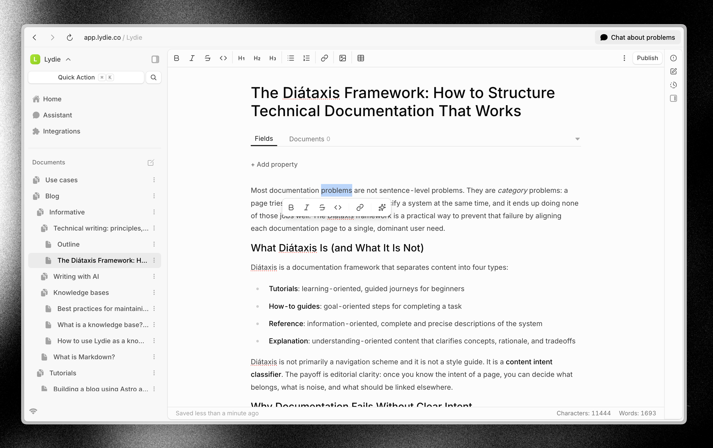

# Lydie

Lydie is a high-performance writing workspace that scales from simple notes to deeply structured, interconnected knowledge systems.



## 🚀 Quick Start

### Development (SST, recommended)

```bash
bun install
bun run db:migrate
bun run dev
```

`dev` auto-starts Docker Postgres and auto-stops it on exit.
If you want to keep Postgres running after exit, use `KEEP_DB_RUNNING=1 bun run dev`.

This starts the local SST multiplexer and runs local dev processes for:

- **Web App**: http://localhost:3000
- **Backend API**: http://localhost:3001
- **Zero Sync**: http://localhost:4848
- **Marketing**: local Astro dev server in the SST tabs

`sst dev` still expects Postgres at `localhost:5432`; `bun run dev` now handles that automatically.

### Development (Docker, optional)

```bash
bun run docker:dev
```

Access:

- **Web App**: http://localhost:3000
- **Backend API**: http://localhost:3001
- **Zero Sync**: http://localhost:4848

Run migrations (if needed):

```bash
bun run db:migrate
```

### Production (AWS)

See [Deployment Guide](docs/DEPLOYMENT.md) for AWS deployment with SST.

```bash
bun run deploy:prod
```

## 🛠️ Tech Stack

- **Frontend**: React, Vite, TanStack Router
- **Backend**: Hono, Better Auth
- **Database**: PostgreSQL, Drizzle ORM
- **Real-time**: Zero sync, WebSockets
- **AI**: Vercel AI SDK
- **Infrastructure**: SST (local orchestration + AWS), Docker (optional local/self-host)

## 📁 Project Structure

```
├── docker/                 # Docker Compose + nginx config
├── infra/                  # SST AWS infrastructure
├── packages/
│   ├── config/            # Environment configuration
│   ├── web/               # React SPA
│   ├── backend/           # Hono API server
│   ├── core/              # Shared logic
│   ├── database/          # Drizzle ORM schema
│   └── zero/              # Zero sync configuration
└── docs/
    └── DEPLOYMENT.md      # Local dev, self-hosting & AWS deployment
```

## 📦 Deployment Options

| Environment   | Command      | Notes                          |
| ------------- | ------------ | ------------------------------ |
| **Local Dev** | `bun run dev` | SST multiplexer + local processes |
| **Local Dev (Alt)** | `bun run docker:dev` | Docker Compose with hot reload |
| **AWS Prod**  | `bun run deploy:prod` | ECS Fargate, S3, CloudFront |

## 🧪 Development

```bash
# Start local development (recommended)
bun run dev

# Optional: Docker-based development
bun run docker:dev

# Optional: run migrations
bun run db:migrate

# Optional: Postgres only for SST dev
bun run docker:db:up
```

## 🔄 CI/CD

GitHub Actions workflow included at `.github/workflows/ci-cd.yml`:

1. Lint and type check
2. Build Docker images
3. Run E2E tests
4. Deploy with SST

## 📚 Documentation

- [Deployment](docs/DEPLOYMENT.md) - Local dev, self-hosting & AWS production deployment
- [Migration Summary](MIGRATION_SUMMARY.md) - Implementation details

## 📄 License

MIT License - See [LICENSE](LICENSE) for details
